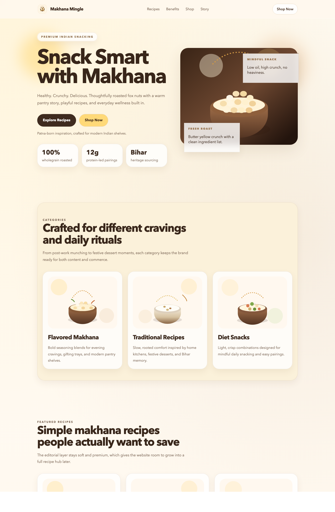
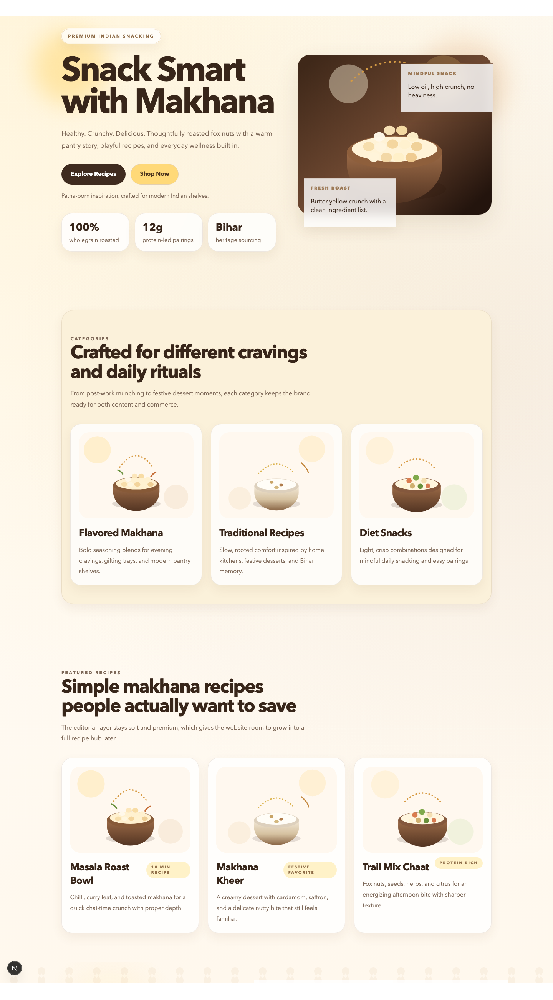
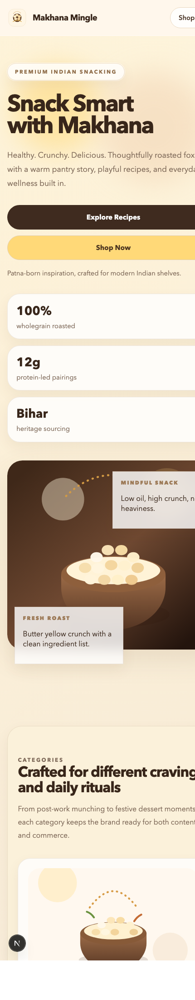

# Makhana Mingle

## [Live Demo](https://makhana-mingle.vercel.app/)

## [GitHub Repository](https://github.com/sonimohit481/Makhana-Mingle)

[](https://nextjs.org/)
[](https://react.dev/)
[](https://www.typescriptlang.org/)
[](https://vercel.com/analytics)
[](https://eslint.org/)

## Table of Contents

- [Introduction](#introduction)
- [Tech Stack](#tech-stack)
- [Features](#features)
- [Screenshots](#screenshots)
- [Quick Start](#quick-start)
- [Project Structure](#project-structure)
- [Links](#links)
- [Author](#author)

## Introduction

Makhana Mingle is a premium food brand landing page built with Next.js App Router. The project presents makhana as a modern Indian pantry product through editorial storytelling, recipe-led content, wellness-focused messaging, and a clean e-commerce-ready layout.

The interface combines a warm visual identity with custom illustrations, responsive sections, and polished content blocks designed to support future growth into product detail pages, cart flows, and richer content routes.

## Tech Stack

- Next.js 16
- React 19
- TypeScript
- App Router
- CSS with custom design tokens
- Vercel Analytics
- ESLint

## Features

- Responsive premium landing page for a modern makhana brand
- Hero section with strong brand positioning and call-to-action buttons
- Category and recipe sections using custom illustration assets
- Health benefits section with lightweight visual storytelling
- Product showcase designed for future e-commerce expansion
- Brand story section rooted in Bihar-origin sourcing
- Newsletter signup area and testimonial blocks
- Footer modals for project and developer details
- SEO-friendly metadata and Open Graph setup

## Screenshots

### Desktop Hero



### Product And Story Sections



### Mobile View



## Quick Start

### Prerequisites

- Node.js 18 or later
- npm

### Installation

```bash
git clone https://github.com/sonimohit481/Makhana-Mingle.git
cd Makhana-Mingle
npm install
```

### Run Locally

```bash
npm run dev
```

Open [http://localhost:3000](http://localhost:3000) in your browser.

### Production Build

```bash
npm run build
npm run start
```

## Project Structure

```bash
Makhana-Mingle/
├── app/
│   ├── globals.css
│   ├── icon.svg
│   ├── layout.tsx
│   └── page.tsx
├── components/
│   └── footer-info-modal.tsx
├── public/
│   ├── bihar-pond.svg
│   ├── hero-bowl.svg
│   ├── logo-mark.svg
│   ├── logo.png
│   ├── og-image.svg
│   ├── recipe-kheer.svg
│   ├── recipe-mix.svg
│   ├── recipe-roast.svg
│   └── screenshots/
├── next.config.ts
├── package.json
└── tsconfig.json
```

## Links

- Live Demo: [https://makhana-mingle.vercel.app/](https://makhana-mingle.vercel.app/)
- Repository: [https://github.com/sonimohit481/Makhana-Mingle](https://github.com/sonimohit481/Makhana-Mingle)

## Author

- Mohit Soni
- Portfolio: [https://mohitsoni.dev](https://mohitsoni.dev)
- GitHub: [https://github.com/sonimohit481](https://github.com/sonimohit481)
- LinkedIn: [https://www.linkedin.com/in/mohitsoni481/](https://www.linkedin.com/in/mohitsoni481/)

---

Built to present Indian snacking in a warmer, more modern, and more premium digital format.
